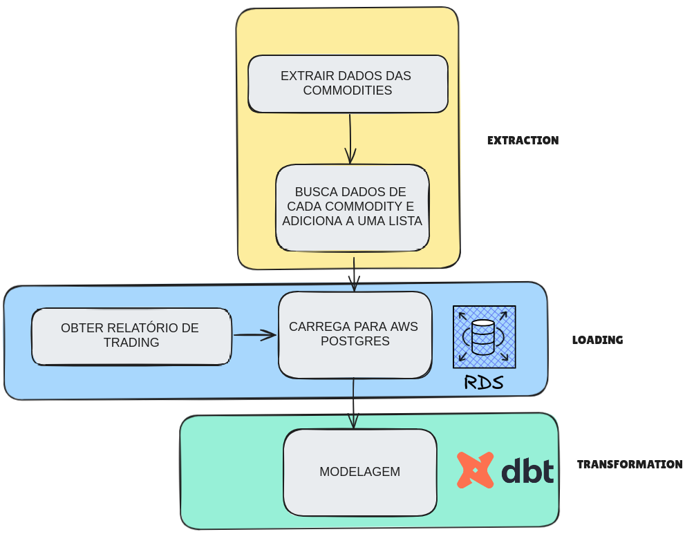

###

# ELT + DBT-Core PARA DATA WAREHOUSE DE COMMODITIES

### MOTIVAÇÃO

**Por que uma empresa precisaria de um Data Warehouse?**
No ambiente empresarial é uma constante as perguntas sobre o estado de produtos ou serviços, e isso implica em obter combinações de dados de diferentes fontes e formatos que muitas vezes não são amplamente conhecidos por toda a organização. Portanto, perguntas simples podem tomar dimensões absurdas por falta de consenso entre as diferentes perspectivas envolvidas.
Outros indícios de que um DW geraria valor para o negócio:
- Muito trabalho manual;
- Baixa performance;
- Dificuldade de consultar dados;
- Excesso de processamento;
- Mais custos e menos produtividade;

### CONTEXTO DO PROJETO
Uma empresa do ramo de Commodities precisa obter os preços de mercado atualizados para enriquecer um relatório trading;\
Para isso, o preço dos ativos será obtido via API e carregados para um DW e modelados utilizando DBT;

O DBT (Data Build Tool) gerencia e transforma os dados do Data Warehouse (DW) de commodities. O objetivo é criar um pipeline de dados robusto e eficiente que trata e organiza os dados de commodities e suas movimentações para análise.

### WORKFLOW



## ESTRUTURA

### 1. Seeds

Os seeds são dados estáticos que são carregados no Data Warehouse a partir de arquivos CSV. Neste projeto, usamos seeds para carregar dados de movimentações de commodities.

### 2. Models

Os models definem as transformações de dados usando SQL. Eles são divididos em duas camadas principais: staging e datamart.

#### Staging

A camada de staging é responsável por preparar e limpar os dados antes que eles sejam carregados nas tabelas finais de análise.

- **stg_commodities.sql**: Trata e formata os dados das commodities extraídos da API.
- **stg_commodities_trade.sql**: Trata e formata os dados de movimentações das commodities.

#### Datamart

A camada de datamart é onde os dados finais de análise são armazenados. Eles são baseados nos dados preparados pela camada de staging.

- **dm_commodities.sql**: Integra os dados tratados das commodities e das movimentações, criando um modelo de dados final para análise.

### 3. Sources

Os sources são as tabelas ou arquivos de origem dos dados que o DBT utiliza para realizar as transformações.

### 4. Snapshots

Os snapshots são utilizados para manter um histórico de como os dados mudam ao longo do tempo.

## Estrutura de Diretórios

```
├── models
│   ├── staging
│   │   ├── stg_commodities.sql
│   │   └── stg_commodities_trade.sql
│   └── datamart
│       └── dm_commodities.sql
├── seeds
│   └── commodities_trade.csv
├── dbt_project.yml
└── README.md
```

## EXECUTANDO O PROJETO

### REQUISITOS

- Python 3.7+
- DBT

### PASSO A PASSO

1. **Clonar o Repositório**:
   ```
   git clone <https://github.com/lksprado/DW-ETL-end_to_end>
   cd <Nome-do-Repositório>
   ```

2. **Instalar o DBT**:
   ```
   pip install dbt-core dbt-postgres
   ```

3. **Configurar o DBT**:
   - Configure o arquivo `profiles.yml` para se conectar ao seu Data Warehouse. O arquivo deve estar no diretório `~/.dbt/` ou no diretório especificado pela variável de ambiente `DBT_PROFILES_DIR`.

   Exemplo de `profiles.yml`:
   ```
   databasesales:
     target: dev
     outputs:
       dev:
         type: postgres
         host: <DB_HOST_PROD>
         user: <DB_USER_PROD>
         password: <DB_PASS_PROD>
         port: <DB_PORT_PROD>
         dbname: <DB_NAME_PROD>
         schema: <DB_SCHEMA_PROD>
         threads: 1
   ```

4. **Executar os Seeds do DBT**:
   ```
   dbt seed
   ```

5. **Executar as Transformações do DBT**:
   ```
   dbt run
   ```

6. **Verificar o Estado do Projeto**:
   ```
   dbt test
   ```

---

### DESCRIÇÃO DOS MODELOS

#### stg_commodities.sql

Este model é responsável por tratar e formatar os dados das commodities extraídos da API. Ele faz a limpeza e transformação necessárias para preparar os dados para o datamart.

#### stg_commodities_trade.sql

Este model é responsável por tratar e formatar os dados de movimentações das commodities. Ele faz a limpeza e transformação necessárias para preparar os dados para o datamart.

#### dm_commodities.sql

Este model integra os dados tratados das commodities e das movimentações, criando um modelo de dados final para análise. Ele calcula métricas e agrega os dados para facilitar a análise no dashboard.
